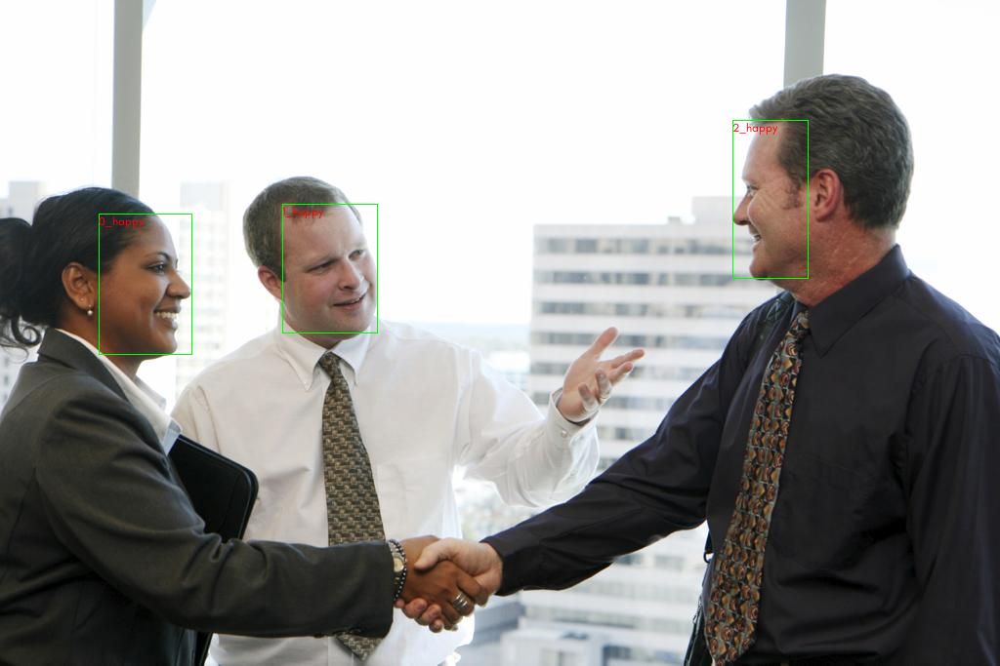
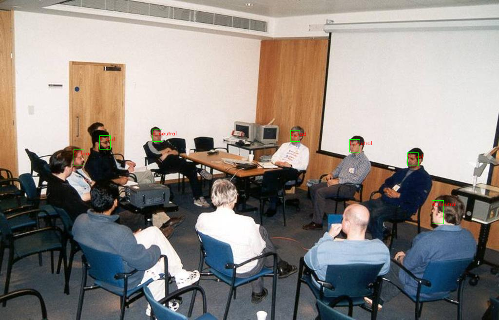
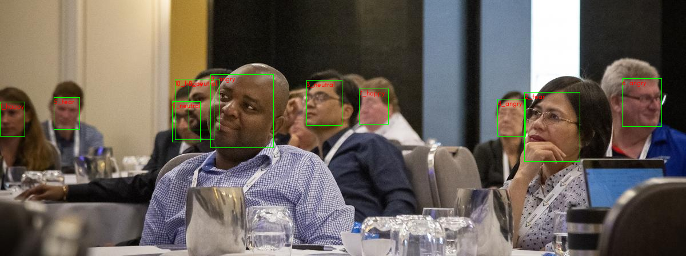

# ML based imaging experiments.

## The repos

This repository contains some experiments I am doing on images, different designs for machine vision, image compression
etc. The contents of the repo will change as more stuff is added.

The repository is unfortunately a mess as some of the work is done using pure python code (which I prefer) and some part
of the work is done on Jupyter notebooks and some part is done in Google Colab (as I don't have a A100 lying around).

Currently working on ~~3~~ 2 things

1) [~~Image Generation.~~](#image-generation)
2) [Classification](#classification)
3) [Deep face and emotion](#deep-face-and-emotion)
4) [Image Encoder and Decoder (WIP)](#image-encoder-and-decoder)

## Deep face and emotion


This does not use any training, however, this is about using existing trained ML model to determine the bounding boxes
of people's faces in pictures and then determine


their emotion. For finding the bounding boxes yolo-v8 is used. For acquiring the emotional state of the face, DeepFace
is being used.

In general clear pictures produces good emotional results as shown below with high confidence level.



However, blurry images, obscured faces will cause the DeepFace algo to fail and sometimes provide wrong results.



In cases the yolo-v8 fails to find the proper bounding box. It creates too many bounding boxes for overlapping faces.



Also, if there are too many faces, then yolo-v8 fails to provide bounding boxes as required.


This is an older project. It needs to be cleaned up and some stuff is missing like accuracy and F1 scores.

To check its use, see the server at  [https://github.com/SagnikDe2024/DeepFaceEmotion](DeepFaceServer)


## Classification

To test the model architecture, the classification was done on the CIFAR-10 dataset. Hyperparameter optimization is
done using raytune. The searcher used is Optuna and the Scheduler used is ASHAScheduler. The model consists of CNN
layers followed by a FCN part.

### Summary of results

Efforts were made to lower the number of CNN and FCN layers and also the number of parameters. Decreasing layers means
that gradient propagation issues won't appear.
Also, attempts were made to ensure that the number of parameters < 1M. Focus was on minimizing validation loss while
keeping the number of parameters < 1M.

With that in mind, the optimizer settled on the following parameters.

| Parameters        | Value |
|-------------------|-------|
| batch_size        | 125   |
| cnn_layers        | 6     |
| fcn_layers        | 4     |
| final_channels    | 210   |
| learning_rate     | 0.001 |
| starting_channels | 46    |

The final model has 6 CNN layers and 4 FCN layers. It has 875,592 parameters with an estimated parameter size of 3.1 MB.
A large number of parameters ~60% are
taken up by the last CNN (293160) and the first FCN (232957) layer.

The accuracy[^acc] achieved for each of the CIFAR-10 classes is shown
below.[^1]

| Class | Accuracy (%) |
|-------|--------------|
| plane | 86.3         |
| car   | 89.4         |
| bird  | 74.9         |
| cat   | 74.3         |
| deer  | 84.7         |
| dog   | 71.9         |
| frog  | 84.4         |
| horse | 81.8         |
| ship  | 93.5         |
| truck | 89.2         |

The validation loss (vloss) is 0.541896045207977.

CIFAR-10 is extremely challenging to improve accuracy on. The classes 'cat' and 'dog' seemed to cause the most problems.
All the models achieving > 90% accuracy seemed to use significantly much larger number of parameters and featured skip
connections. The images being small and blurry definitely hurts the performance of the classifier.

The experimentation was done mostly on the CNN side of things, with kernel sizes, number of feature extracted (channels)
and how
much downscaling needs to be done.

Kernel size = $3 \times 3$.  
Final the image is downsampled to $16 \times$.  
CNN channel upscale ratio = 1.3548533596918833  
CNN Layers = 6,  
downsampled_sizes = `[20, 13, 8, 5, 3, 2]`  
channels = `[46, 62, 84, 114, 155, 210]`  
FCN layers = `[840, 277, 92, 30, 10]`

MachineVisionExperiments\checkpoints\tune_classifier\4_20250408T035811_
-8491173734139600649_1\checkpoint_000009\model_checkpoint.pth

### Experimental highlights

1) Batchnorm works ! There is some disagreement in the ML community whether to put them before the activations or after
   the activations. I mean it works really well, the validation error just got sliced to half when I removed the bias of
   the CNN filter and replaced with a batchnorm on the output channels.
2) Dividing a $3 \times 3$ kernel into $1 \times 3$ + $3 \times 1$ kernel is useful if the number of parameters is too
   high. In my case it decreased model performance as CIFAR-10 really likes more parameters.
3) FractionalMaxPool2D is significantly more flexible compared to plain old MaxPool2D. So in spite of the CNN layers
   downsampling the image by 16, we don't have $\log_2(16) = 4$ layers, but 6 layers. Not sure how popular this is.
4) My intuition was that the number of features extracted will be small in the first layer like 24-32 and last CNN layer
   will have a lot of them like ~300. Interestingly when experimenting with hyperparameter tuning one has the first
   layer extracting 46 features and the last layer extracting 210 features.
5) Properly configuring ray tune to tune hyperparameters is an experiment in itself. If one is not careful the number of
   parameters will blow up quickly and training will slow down significantly. Instead of guessing the learning rate and
   batch size, one can use them as hyperparameters.
6) To prevent a parameter explosion, I changed from purely minimizing vloss to acceptable amount of vloss with the
   minimum number of parameters. So I roughly used $\text{efficiency} =\frac{1}{\text{vloss} \times \text{parameters}}$
   as working principle and redid the model tuning tighter hyperparameter bounds multiple times.

### Annoyances encountered

1) Ray tune has a bug in `tune.quniform` where it completely ignores the quantization if the quantization value is 1.
   Wasted too much valuable man-hours hunting down why some of the training is erroring out.
2) The model must be compiled before training or the training will be very slow. However, compiled pytorch model not
   [saveable](https://github.com/pytorch/pytorch/issues/101107#issuecomment-1542688089)  (or picklable) ! Nowhere in the
   `torch.compile` documentation tells us that. Anyway I found
   a [workaround](https://clay-atlas.com/us/blog/2023/12/03/pytorch-compile-model-state-fict-orig-mod/).
3) If ray tune is run on a single computer with multiple child processes launched, then the `torch.compile` might have a
   conflict when generating compiled code. So expect an error the first time.
4) Optuna seems to have issues resuming from an existing tuning experiment which got terminated, preferring to start a
   new study instead.
5) The ray tune directory naming can cause issues in Windows, and it has a tendency to use illegal characters. So a new
   directory naming scheme needed to be created.

---

## Image Encoder and Decoder

The current intention is to run the


---

## Image generation

This repo started out as a personal project image generation and has evolved (devolved ?) to something else.
Inspired by image generation systems like Stable Diffusion and Flux, an attempt was made to create a VAE
so that one can generate multiple samples as long as the $\sigma$ and $\mu$.

Obviously I gave up on this project, since I faced too many difficulties. Let me explain with the help of 2
classes $\rightarrow$ [cat, tree]


1) One can use the image of the class 'cat' to generate $\sigma$ and $\mu$ to generate pictures of a cat. However,
   during evaluation one needs a classifier to test if the generated sample is that of a cat. This also means that a
   classifier needs to be designed first.
2) Down the line I realized that using images are not useful to generate $\sigma$ and $\mu$ as then it won't be able to
   generate picture of cat and tree at the same time. A better option use to use
    1) a one hot encoded vector to represent the classes. Then use linear combination of the vectors to
       generate $\sigma$ and $\mu$.
    2) a text encoder to generate the $\sigma$ and $\mu$.
3) Looking through existing literature it is obvious that the generated images from VAEs are blurry which somehow
   escaped my attention during my first reading.
    1) This is **extremely disappointing**. I am not interested in fine-tuning and spending time on a model only get bad
       images. I
       just stopped here and started doing thinking of doing something else.
    2) Blurry images can confuse the classifier. This also means that I need to spend a lot of time making a good
       classifier.
    3) Maybe using $N(0,1)$ as a prior is not a good idea, perhaps using a power law distribution is better. Not sure
       how to do KL-Divergence of power law though.
4) I know that there are VQ-VAEs and Normalizing Flows (NF) but the design of NF is very different from VAEs in general.

If I am using normalized flows maybe one can have some model like the one below where the Jacobian $J$ is generated
using the text encoder and instead of operating directly on the image, operates on smaller dimensional $z$

```math 
x \rightarrow ImageEncoder \rightarrow z 
```

```math  
t \rightarrow TextEncoder \rightarrow J  
```

```math  
z \rightarrow J \rightarrow z_g  
```

```math  
z_g \rightarrow ImageDecoder \rightarrow x_g  
```
### Some additional thoughts


### Some additional thoughts

For normal image generation in a commercial environment use one can use a Transformer (Google's T5 and ViT-L) from
HuggingFace and a model like Stable Diffusion (or Flux depending on license) and generate images as required. One can
also train a LORA or a DORA to modify the inference of the underlying UNet and get results.


Another solution will be to use ComfyUI which I use personally.

[^1]: Probably F1 scores is a better indication. Just using accuracy as everyone else seems to be using it.
[^acc]: Apparently accuracy is not that [important](https://www.youtube.com/watch?v=-hOytdI3pzU).
